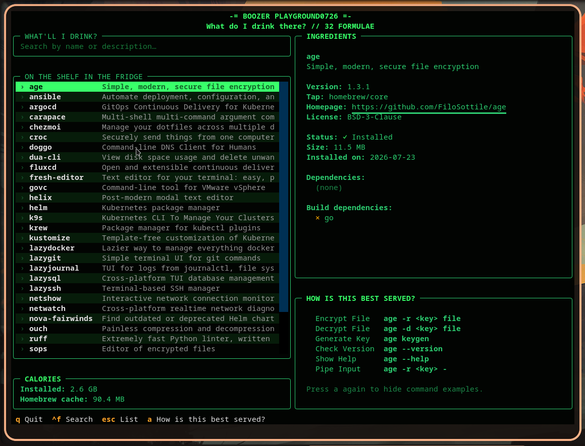

# boozer

> 🐍🍺 boozer — the cheapest dive in the county, where the only thing on tap is snakes (pythons, you know the drill). It runs fast, pours generously, but if you’re looking for a real shitstorm — head over to Go’s [taproom](https://github.com/hzqtc/taproom): the selection is wider and the atmosphere is a whole lot fancier.

TUI for browsing Homebrew formulae you installed yourself (`brew leaves
--installed-on-request`), with an extended detail panel, disk-usage
summary, and a "how is this best served?" command cheat-sheet.



## Run

```bash
uv sync
uv run python -m boozer
```

Demo without a real brew install:

```bash
BREW_TUI_MOCK=1 python -m boozer
```

### Install as a system command

```bash
uv tool install --python 3.14 -e .
```

This installs `boozer` as a standalone CLI command (editable, so local
changes to the source take effect immediately without reinstalling) —
run it from anywhere with just `boozer`.

## Layout

```
boozer/
├── app.py              — Textual App: composition + event wiring only
├── boozer.tcss           — all styling (external stylesheet, not embedded in .py)
├── models.py               — Formula: pure data, zero I/O
├── theme.py                  — palette hex constants (used by inline Rich markup)
├── brew/                       — everything that talks to `brew`/`du`/the filesystem
│   ├── cli.py                    — raw subprocess primitives (run, du_kb, format_size)
│   ├── queries.py                  — one function per brew/du command
│   ├── info.py                       — orchestration: builds Formula objects,
│   │                                    including the tap name-collision fix
│   ├── mock.py                         — BREW_TUI_MOCK fake data
│   └── __init__.py                      — public API (5 functions, that's it)
├── examples/                    — "How is this best served?" knowledge base
│   ├── types.py                    — Example(label, command)
│   ├── curated.py                    — hand-picked examples, always available
│   ├── llm.py                          — real LM Studio-backed provider (see below)
│   ├── cache.py                          — disk cache backing CachingProvider
│   ├── provider.py                         — ExampleProvider interface +
│   │                                          TldrProvider design sketch (not implemented)
│   └── __init__.py                          — get_examples(formula), provider chain
└── widgets/                      — Textual widgets, presentation only
    ├── detail_panel.py
    ├── examples_panel.py
    └── weight_panel.py
```

Rule of thumb: nothing outside `boozer/brew/` imports `subprocess`;
nothing outside `boozer/widgets/` and `app.py` imports from `textual`.
`models.py` is the shared vocabulary between the two sides.

## "How is this best served?"

Examples come from a provider chain, tried in order until one answers
(see `boozer/examples/provider.py` for the full design rationale):

1. **CuratedProvider** — a small hand-picked dict, instant, no network.
2. **CachingProvider(LlmProvider())** — disk cache first
   (`~/.cache/boozer/examples/`); on a miss, asks a local
   [LM Studio](https://lmstudio.ai) model for 5-6 example commands and
   writes the result through to the cache.
3. **TldrProvider** (fetching community [tldr-pages](https://github.com/tldr-pages/tldr)
cheat sheets) is designed in `provider.py` but **not implemented**.

### Enabling the LLM provider

Off by default. To turn it on:

1. Run [LM Studio](https://lmstudio.ai), load a model, and start its
   local server (Developer tab → Start Server). It exposes an
   OpenAI-compatible API at `http://localhost:1234/v1` by default.
2. Set:
   ```bash
   export BOOZER_ENABLE_LLM_EXAMPLES=1
   python -m boozer
   ```

Optional configuration:

| Variable                     | Default                      | Meaning                                    |
|-------------------------------|-------------------------------|---------------------------------------------|
| `BOOZER_ENABLE_LLM_EXAMPLES`   | unset (off)                    | must be `1`/`true`/`yes` to enable at all    |
| `BOOZER_LM_STUDIO_URL`          | `http://localhost:1234/v1`      | LM Studio's OpenAI-compatible base URL       |
| `BOOZER_LM_STUDIO_MODEL`         | `local-model`                    | model id sent in the request — **required** if your LM Studio serves more than one model (check `curl <url>/v1/models`), since an unmatched id gets silently rejected |
| `BOOZER_LM_STUDIO_MAX_TOKENS`     | `1024`                            | generation budget for the answer itself     |
| `BOOZER_LM_STUDIO_THINKING`        | unset (off)                        | set `1`/`true`/`yes` to let the model reason before answering (see below) |
| `BOOZER_LM_STUDIO_TIMEOUT`          | `90` (seconds)                      | generation timeout — raise for slower/larger models |
| `BOOZER_CACHE_DIR`                  | `~/.cache/boozer/examples`            | where resolved examples are cached on disk   |

###  Reasoning ("thinking") models

Some local models (e.g. Qwen3.5) can reason internally before answering. This helps with complex tasks but can waste the token budget on simple requests like "give me 6 JSON objects", leaving content empty with finish_reason: "length".

boozer disables thinking by default via chat_template_kwargs: {"enable_thinking": false}. This works only with templates supporting the option (Qwen3.5 does). To enable reasoning, set BOOZER_LM_STUDIO_THINKING=1. If the model exhausts BOOZER_LM_STUDIO_MAX_TOKENS while reasoning, boozer returns "no examples" rather than using partial reasoning_content.

###  How it behaves
Curated formulae never use the network. The LLM is queried only when no curated match exists.
Fails fast if LM Studio is unavailable with a ~1.5s TCP check instead of waiting for a long timeout.
Never blocks the UI. Examples load only when you open the panel (a) and run in the background; you can keep navigating.
Cached per (formula, version). Each formula is sent to the model only once. The cache also invalidates after brew upgrade.
Tolerates messy output. JSON wrapped in Markdown fences or extra text is handled by extracting the first [...] block. Invalid output becomes "no examples" rather than a crash.
